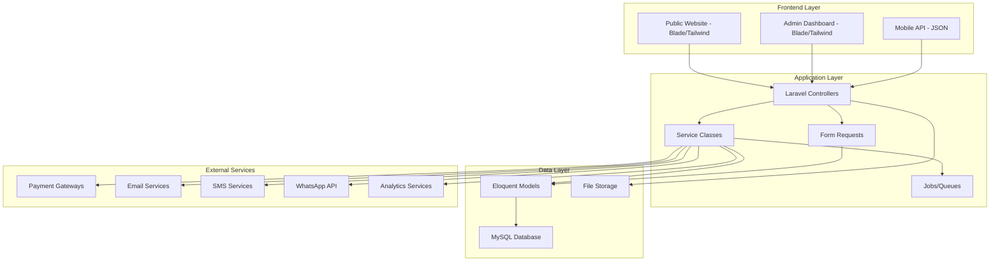
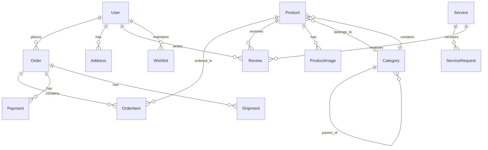

# Design Document: AKAAT Technologies Business Website

## Overview

The AKAAT Technologies business website is a comprehensive Laravel-based web application that serves as a complete business management platform. It combines a public-facing business website with a full-featured e-commerce system, customer management platform, and administrative dashboard. The system is designed to handle multiple business functions including service showcasing, product sales, order management, customer relationships, and business analytics.

The architecture follows Laravel best practices with a clean separation between the public frontend (built with Blade templates and Tailwind CSS), the administrative backend, and the API layer for future mobile integration. The system uses MySQL for data persistence and integrates with multiple third-party services for payments, communications, and analytics.

## Architecture

### System Architecture Overview



### Technology Stack

- **Backend Framework**: Laravel 12 with PHP 8.4
- **Frontend**: Blade templates with Tailwind CSS and Livewire components
- **Database**: MySQL 8.0 with proper indexing and relationships
- **Authentication**: Laravel Fortify for multi-guard authentication
- **File Storage**: Laravel filesystem with cloud storage support
- **Queue System**: Redis-backed queues for background processing
- **Caching**: Redis for session and application caching
- **Testing**: Pest for unit and feature testing
- **Code Quality**: Laravel Pint for code formatting

### Professional Laravel Development Standards

#### Project Architecture Standards
- **Feature-based folder structure**: Organized by business domains (Printing, Shop, Services, Admin)
- **Thin controllers**: Controllers only handle HTTP requests and responses
- **Service layer**: Business logic encapsulated in Service classes and Actions
- **Reusable components**: Blade components for consistent UI elements
- **Clean separation**: Clear boundaries between presentation, business logic, and data layers

#### Controller and Logic Rules
- Controllers MUST only handle request/response cycle
- NO business logic inside controllers
- Service classes handle all business workflows (orders, shop operations, service management)
- Actions pattern for single-responsibility operations
- Form Request classes for all validation logic

#### Database and Model Standards
- Migrations ONLY for database changes (no manual DB modifications)
- Proper foreign key constraints and database indexing
- Eloquent relationships instead of raw SQL queries
- Enums for status fields (order status, payment status, user roles)
- Model factories for consistent test data generation

#### Authentication and Authorization
- Laravel's built-in authentication system
- Role-based permissions via Gates and Policies
- NO hardcoded admin checks in code
- Middleware for route protection
- Multi-guard authentication for different user types

#### File Management Standards
- Laravel Storage API for all file operations
- Files stored outside public directory for security
- Storage symlinks for secure public access
- Proper file validation (type, size, content)
- Cloud storage integration for scalability

#### Frontend and UI Standards
- Blade templates with Tailwind CSS
- Component-driven UI architecture
- NO PHP business logic in Blade views
- Mobile-first responsive design approach
- Livewire for dynamic interactions without JavaScript complexity

#### Configuration Management
- Environment variables via .env files
- NO secrets or credentials in code
- Config files for application constants
- Environment-specific configurations
- Secure configuration for production deployment

#### Security Implementation
- CSRF protection enabled on all forms
- Mass assignment protection on models
- Comprehensive input validation and sanitization
- HTTPS enforcement across all endpoints
- File upload security with type and content validation

#### Performance and Scalability Design
- Start simple, avoid overengineering
- Prepared for caching implementation (Redis)
- Queue system ready for background processing
- Database query optimization from the start
- Scalable from shared hosting to VPS deployment

#### Development Workflow Standards
- Git version control from project inception
- Clean, descriptive commit messages
- Feature branch workflow
- Code review process
- Automated testing in CI/CD pipeline

### Security Architecture

- HTTPS enforcement across all endpoints
- CSRF protection on all forms
- SQL injection prevention through Eloquent ORM
- XSS protection via Blade template escaping
- Rate limiting on API endpoints and forms
- Role-based access control (RBAC) for admin functions
- Secure file upload validation and storage
- PCI-compliant payment processing integration

## Components and Interfaces

### Application Structure Following Laravel Best Practices

#### Feature-Based Organization
```
app/
├── Http/
│   ├── Controllers/
│   │   ├── Admin/           # Admin dashboard controllers
│   │   ├── Shop/            # E-commerce controllers  
│   │   ├── Services/        # Service management controllers
│   │   └── Api/             # API controllers
│   ├── Requests/            # Form Request validation classes
│   └── Middleware/          # Custom middleware
├── Services/                # Business logic services
│   ├── OrderService.php
│   ├── PaymentService.php
│   ├── NotificationService.php
│   └── InventoryService.php
├── Actions/                 # Single-responsibility actions
│   ├── CreateOrder.php
│   ├── ProcessPayment.php
│   └── SendNotification.php
├── Models/                  # Eloquent models with relationships
├── Enums/                   # Status and type enumerations
└── Policies/                # Authorization policies
```

### Public Website Components

#### Homepage Component
- Hero section with company branding and value proposition
- Service showcase cards with call-to-action buttons
- Featured products carousel
- Customer testimonials slider
- WhatsApp integration widget
- Newsletter subscription form
- **Implementation**: Blade component with Livewire for dynamic content

#### Service Pages Component
- Service category navigation (Printing, Development, Training)
- Detailed service descriptions with pricing
- Service request forms with file upload capability
- Portfolio/case studies display
- Service comparison tables
- Lead capture forms
- **Implementation**: RESTful controllers with Service layer for business logic

#### Product Catalog Component
- Product grid with filtering and search
- Product detail pages with image galleries
- Category-based navigation
- Stock availability indicators
- Price display with discount calculations
- Related products suggestions
- **Implementation**: Eloquent relationships with proper indexing for performance

#### Shopping Cart Component
- Add to cart functionality
- Cart summary with quantity controls
- Guest and registered user checkout flows
- Multiple payment method integration
- Order confirmation and tracking
- Abandoned cart recovery system
- **Implementation**: Session-based cart with database persistence for registered users

### Administrative Dashboard Components

#### Dashboard Overview
- Key performance indicators (KPIs) widgets
- Recent orders and activity feed
- Revenue charts and analytics
- System health monitoring
- Quick action buttons
- Notification center
- **Implementation**: Admin middleware with Policy-based authorization

#### Content Management System
- Page content editor with WYSIWYG
- Media library management
- SEO meta tag management
- Menu and navigation builder
- Blog/news management
- Template customization
- **Implementation**: Form Requests for validation, Service classes for content operations

#### Order Management System
- Order listing with advanced filtering
- Order detail views with status tracking
- Customer communication tools
- Inventory management integration
- Shipping label generation
- Return and refund processing
- **Implementation**: Enum-based status management, Queue jobs for notifications

#### Customer Relationship Management
- Customer profile management
- Lead tracking and scoring
- Communication history
- Segmentation and targeting
- Customer lifetime value analytics
- Support ticket management
- **Implementation**: Eloquent relationships with proper indexing

#### Analytics and Reporting
- Sales performance dashboards
- Customer behavior analytics
- Inventory turnover reports
- Marketing campaign performance
- Financial reporting with tax calculations
- Custom report builder
- **Implementation**: Database views and optimized queries for reporting

### API Layer Components

#### RESTful API Endpoints
- Authentication endpoints (login, register, refresh)
- Product catalog API with filtering
- Order management API
- Customer profile API
- Payment processing API
- Notification API

#### Webhook Integration
- Payment gateway webhooks
- Shipping provider webhooks
- Third-party service notifications
- Real-time data synchronization
- Event-driven architecture support

## Data Models

### Core Business Models

#### User Model
```php
class User extends Authenticatable
{
    protected $fillable = [
        'name', 'email', 'phone', 'email_verified_at',
        'password', 'role', 'status', 'preferences'
    ];
    
    protected $casts = [
        'email_verified_at' => 'datetime',
        'preferences' => 'array'
    ];
    
    // Relationships
    public function orders(): HasMany;
    public function addresses(): HasMany;
    public function wishlist(): HasMany;
    public function reviews(): HasMany;
}
```

#### Product Model
```php
class Product extends Model
{
    protected $fillable = [
        'name', 'slug', 'description', 'short_description',
        'price', 'sale_price', 'sku', 'stock_quantity',
        'category_id', 'status', 'featured', 'meta_data'
    ];
    
    protected $casts = [
        'price' => 'decimal:2',
        'sale_price' => 'decimal:2',
        'featured' => 'boolean',
        'meta_data' => 'array'
    ];
    
    // Relationships
    public function category(): BelongsTo;
    public function images(): HasMany;
    public function reviews(): HasMany;
    public function orderItems(): HasMany;
}
```

#### Order Model
```php
class Order extends Model
{
    protected $fillable = [
        'user_id', 'order_number', 'status', 'total_amount',
        'tax_amount', 'shipping_amount', 'discount_amount',
        'payment_status', 'payment_method', 'shipping_address',
        'billing_address', 'notes'
    ];
    
    protected $casts = [
        'total_amount' => 'decimal:2',
        'tax_amount' => 'decimal:2',
        'shipping_amount' => 'decimal:2',
        'discount_amount' => 'decimal:2',
        'shipping_address' => 'array',
        'billing_address' => 'array'
    ];
    
    // Relationships
    public function user(): BelongsTo;
    public function items(): HasMany;
    public function payments(): HasMany;
    public function shipments(): HasMany;
}
```

#### Service Model
```php
class Service extends Model
{
    protected $fillable = [
        'name', 'slug', 'category', 'description',
        'features', 'pricing', 'delivery_time',
        'status', 'meta_data'
    ];
    
    protected $casts = [
        'features' => 'array',
        'pricing' => 'array',
        'meta_data' => 'array'
    ];
    
    // Relationships
    public function requests(): HasMany;
    public function portfolio(): HasMany;
}
```

### Supporting Models

#### Category Model
- Hierarchical category structure for products and services
- SEO-friendly slugs and meta information
- Category-specific attributes and filters

#### Address Model
- Customer shipping and billing addresses
- Address validation and formatting
- Default address management

#### Review Model
- Product and service reviews with ratings
- Review moderation and approval workflow
- Aggregate rating calculations

#### Coupon Model
- Discount codes and promotional offers
- Usage limits and expiration dates
- Conditional discount rules

#### Page Model
- Dynamic page content management
- SEO meta information
- Template assignment and customization

### Database Relationships


## Correctness Properties

*A property is a characteristic or behavior that should hold true across all valid executions of a system—essentially, a formal statement about what the system should do. Properties serve as the bridge between human-readable specifications and machine-verifiable correctness guarantees.*

Based on the prework analysis, I've identified several key properties that need to be validated through property-based testing. After reviewing for redundancy, the following properties provide comprehensive coverage:

### Property 1: Navigation Consistency Across Pages
*For any* page in the system, the navigation structure should be identical and contain all required menu items (Home, About Us, Services, Shop, Contact)
**Validates: Requirements 1.2, 1.1**

### Property 2: Responsive Design Behavior
*For any* viewport size, the system should display appropriate responsive design elements and maintain usability
**Validates: Requirements 1.3**

### Property 3: Brand Color Consistency
*For any* page or component, all color values should match the defined brand palette (Deep Blue #0F4C81, Bright Green #2ECC71, Orange #F39C12)
**Validates: Requirements 2.2**

### Property 4: Service Information Completeness
*For any* service detail page, the system should display service descriptions, pricing information, and delivery timelines
**Validates: Requirements 3.2**

### Property 5: Quote Request Processing
*For any* valid service quote request, the system should capture lead information and send confirmation emails
**Validates: Requirements 3.5**

### Property 6: Product Information Display
*For any* product page, the system should show product images, descriptions, prices, and availability status
**Validates: Requirements 4.2**

### Property 7: Search and Filter Functionality
*For any* search query or filter combination, the system should return relevant results and maintain filter state
**Validates: Requirements 4.3**

### Property 8: Shopping Cart Operations
*For any* product and quantity combination, users should be able to add, remove, and modify cart items successfully
**Validates: Requirements 4.4, 11.1**

### Property 9: Contact Form Processing
*For any* valid contact form submission, the system should send notifications to business and confirmation to user
**Validates: Requirements 5.2**

### Property 10: Admin Content Updates
*For any* content update made through the admin dashboard, changes should be reflected immediately on the public website
**Validates: Requirements 6.3**

### Property 11: Admin Service Management
*For any* service update through the admin dashboard, authorized users should be able to modify descriptions, pricing, and availability
**Validates: Requirements 6.1**

### Property 12: Order Management Operations
*For any* order in the system, admin users should be able to view, update, and track order status
**Validates: Requirements 6.2**

### Property 13: Page Load Performance
*For any* page in the system, load time should be within 3 seconds under standard network conditions
**Validates: Requirements 7.1**

### Property 14: SEO Implementation Consistency
*For any* page in the system, proper SEO meta tags and structured data should be present and valid
**Validates: Requirements 7.2**

### Property 15: HTTPS Security Enforcement
*For any* request to the system, HTTPS encryption should be enforced for all data transmission
**Validates: Requirements 8.1**

### Property 16: Input Validation and Sanitization
*For any* user input (including malicious attempts), the system should validate and sanitize data to prevent security vulnerabilities
**Validates: Requirements 8.2**

### Property 17: Order Processing Completeness
*For any* customer order (printing, products, services), the system should capture all required specifications and generate unique order numbers
**Validates: Requirements 9.1, 9.2**

### Property 18: Payment Gateway Integration
*For any* valid payment request, the system should process payments through integrated gateways and handle responses appropriately
**Validates: Requirements 11.2**

### Property 19: User Authentication Operations
*For any* valid user credentials, the registration and login processes should work correctly and maintain session state
**Validates: Requirements 12.1**

### Property 20: Profile Management Functionality
*For any* user profile update, the system should persist changes and maintain data integrity
**Validates: Requirements 12.2**

## Error Handling

### Input Validation Strategy
- All user inputs validated using Laravel Form Requests
- Client-side validation for immediate feedback
- Server-side validation as the authoritative source
- Comprehensive error messages with actionable guidance
- CSRF protection on all forms
- File upload validation with type and size restrictions

### Database Error Handling
- Transaction rollbacks for multi-step operations
- Graceful handling of constraint violations
- Connection timeout and retry logic
- Data integrity checks and foreign key constraints
- Backup and recovery procedures

### Payment Processing Errors
- Gateway timeout handling with retry mechanisms
- Failed payment notification and recovery flows
- Partial payment handling and reconciliation
- Fraud detection and prevention measures
- PCI compliance for sensitive data handling

### External Service Integration Errors
- API timeout and rate limiting handling
- Fallback mechanisms for critical services
- Circuit breaker pattern for unreliable services
- Webhook failure handling and retry logic
- Service health monitoring and alerting

### User Experience Error Handling
- Friendly error pages with navigation options
- Progressive enhancement for JavaScript failures
- Offline functionality where appropriate
- Loading states and progress indicators
- Graceful degradation for older browsers

## Testing Strategy

### Dual Testing Approach
The testing strategy employs both unit testing and property-based testing as complementary approaches:

- **Unit tests**: Verify specific examples, edge cases, and error conditions
- **Property tests**: Verify universal properties across all inputs
- Together they provide comprehensive coverage where unit tests catch concrete bugs and property tests verify general correctness

### Property-Based Testing Configuration
- **Testing Library**: Pest with custom property testing extensions
- **Minimum Iterations**: 100 iterations per property test
- **Test Tagging**: Each property test tagged with format: **Feature: akaat-business-website, Property {number}: {property_text}**
- **Coverage Requirements**: Each correctness property implemented by a single property-based test

### Unit Testing Focus Areas
- **Specific Examples**: Concrete test cases that demonstrate correct behavior
- **Integration Points**: Testing between components and external services
- **Edge Cases**: Boundary conditions and unusual input scenarios
- **Error Conditions**: Exception handling and failure scenarios

### Testing Categories

#### Frontend Testing
- Blade template rendering with various data sets
- Livewire component interactions and state management
- JavaScript functionality and AJAX requests
- Responsive design across different viewports
- Accessibility compliance testing

#### Backend Testing
- Controller action responses and routing
- Service class business logic
- Database model relationships and queries
- Queue job processing and scheduling
- API endpoint functionality and authentication

#### Integration Testing
- Payment gateway integration flows
- Email and SMS notification delivery
- File upload and storage operations
- Third-party API integrations
- End-to-end user workflows

#### Security Testing
- Authentication and authorization flows
- Input validation and sanitization
- CSRF and XSS protection
- SQL injection prevention
- File upload security

#### Performance Testing
- Page load time measurements
- Database query optimization
- Caching effectiveness
- Concurrent user handling
- Resource utilization monitoring

### Test Data Management
- Factory classes for consistent test data generation
- Database seeding for integration tests
- Mock services for external API testing
- Test environment isolation and cleanup
- Realistic data scenarios for property testing

### Continuous Integration
- Automated test execution on code changes
- Code coverage reporting and thresholds
- Performance regression detection
- Security vulnerability scanning
- Deployment pipeline integration